# 🍦 Heladería Web - Sistema de Pedidos Personalizados

## 📝 Descripción del Proyecto

Este proyecto consiste en una *aplicación web para una heladería*, diseñada para brindar una experiencia personalizada a los clientes. A través de esta plataforma, los usuarios pueden:

- Explorar el menú de helados por categorías.
- Realizar pedidos en línea desde la comodidad de su hogar.
- Personalizar sus productos eligiendo o quitando ingredientes.
- Aplicar promociones activas al momento de la compra.
- Acumular puntos mediante un sistema de fidelización.
- Recibir notificaciones sobre nuevos sabores, descuentos y ofertas especiales.

El sistema está desarrollado en Laravel 11 y usa MySQL como base de datos relacional, manteniendo una arquitectura clara y escalable para facilitar el proyecto.

---
🛠 Requisitos Técnicos
PHP 8.2+

Composer 2.5+

MySQL 8.0+

Laravel 10+

## ⚙️ Cómo ejecutar el proyecto

Sigue estos pasos para ejecutar el proyecto en tu entorno local:

### 1. Clonar el repositorio

git clone https://github.com/tuusuario/sistema-academico.git
cd heladeria
2. Instalar dependencias
composer install
3. Configurar entorno
cp .env.example .env
php artisan key:generate
Editar .env con tus credenciales:

env
DB_DATABASE=heladeria
DB_USERNAME=root
DB_PASSWORD=
4. Ejecutar migraciones y seeders
php artisan migrate --seed
5. Iniciar servidor
php artisan serve
Abrir en navegador: http://localhost:8000

## 🗂 Explicación de las tablas principales

- **Clientes:** Contiene los datos de los usuarios registrados, incluyendo nombre, email, contraseña y estado de la cuenta.

- **Categorias:** Define las categorías de productos para organizar el catálogo (por ejemplo, pizzas, bebidas, postres).

- **Productos:** Almacena los productos disponibles para la venta, con información como nombre, precio base, categoría y si es personalizable.

- **Ingredientes:** Lista los ingredientes que pueden añadirse o quitarse de los productos, con su precio extra y disponibilidad.

- **ProductoIngrediente:** Tabla intermedia que relaciona productos con ingredientes, indicando cuáles son ingredientes por defecto o adicionales.

- **Pedidos:** Registra cada orden realizada por un cliente, con fecha, estado, total y método de pago.

- **DetallePedidos:** Detalla los productos incluidos en cada pedido, la cantidad, precio unitario, subtotal y promociones aplicadas.

- **DetallePedidoIngredientes:** Relaciona los ingredientes específicos seleccionados para cada detalle de pedido, como extras o ingredientes removidos.

- **Fidelizacion:** Contiene información sobre el programa de puntos para clientes, acumulando puntos y niveles según su actividad.

- **TransaccionesPuntos:** Registra las operaciones de puntos en el sistema de fidelización, ya sean acumulaciones o redenciones, vinculadas a pedidos.

- **Promociones:** Define las promociones y descuentos disponibles, con condiciones de aplicación, fechas y tipos.

- **Notificaciones:** Guarda las notificaciones enviadas a los clientes, con título, mensaje, tipo y estado de lectura.

---
## Diagrama entidad-relacion
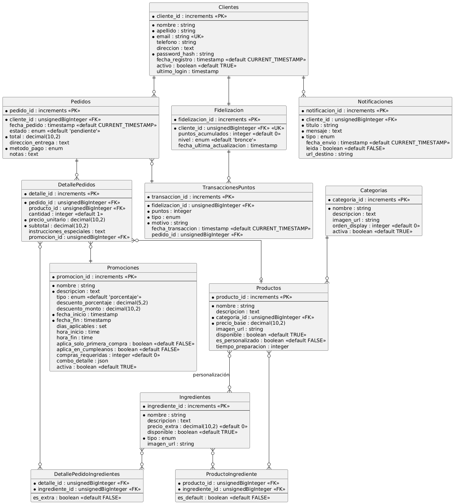

📸 Evidencias de Ejecución

### Migraciones exitosas

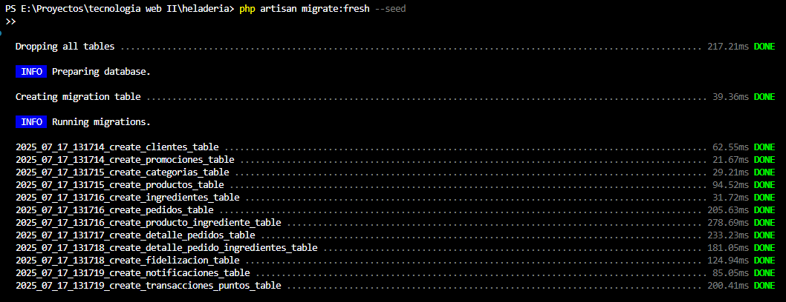
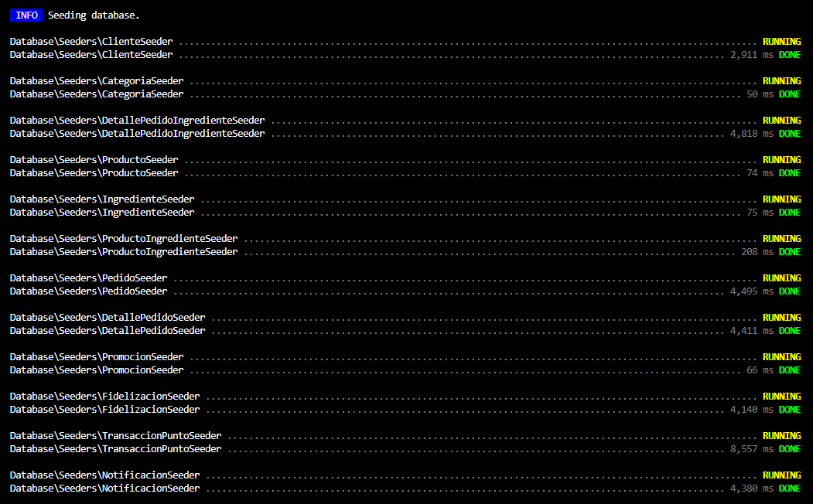

### Datos generados

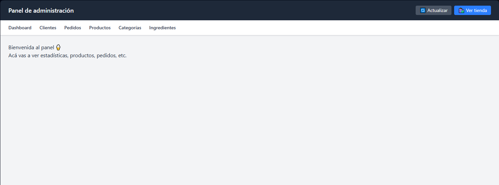  
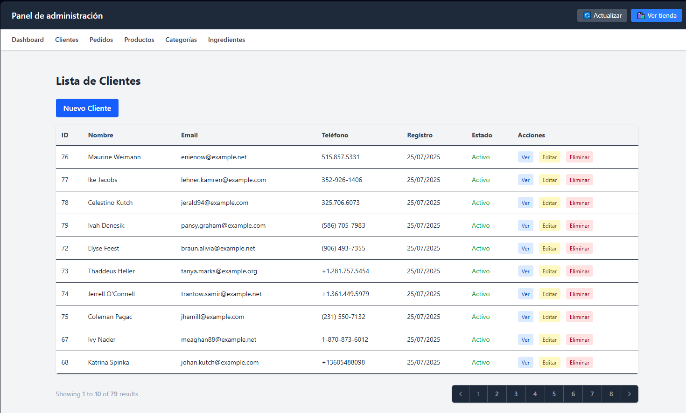  
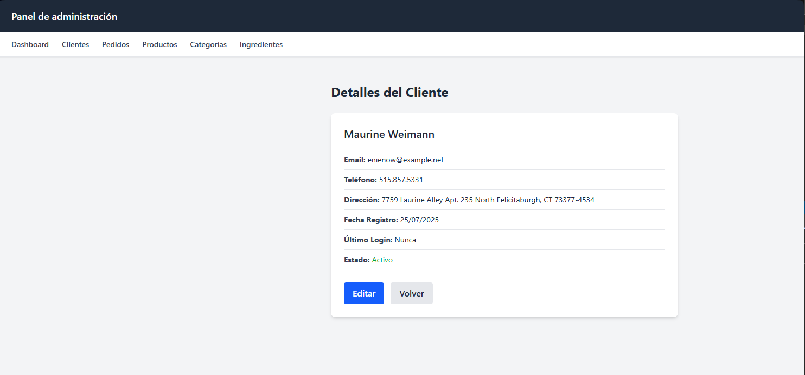  
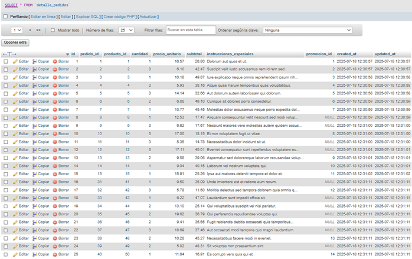  
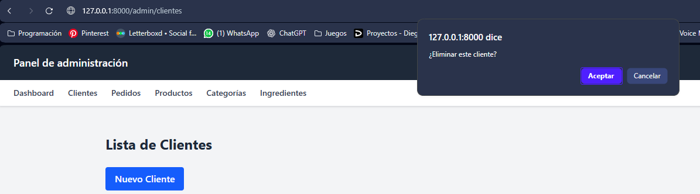  
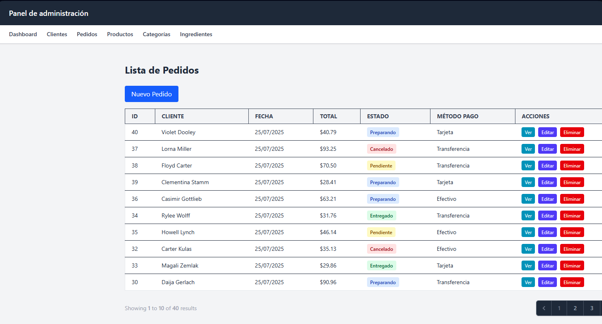  
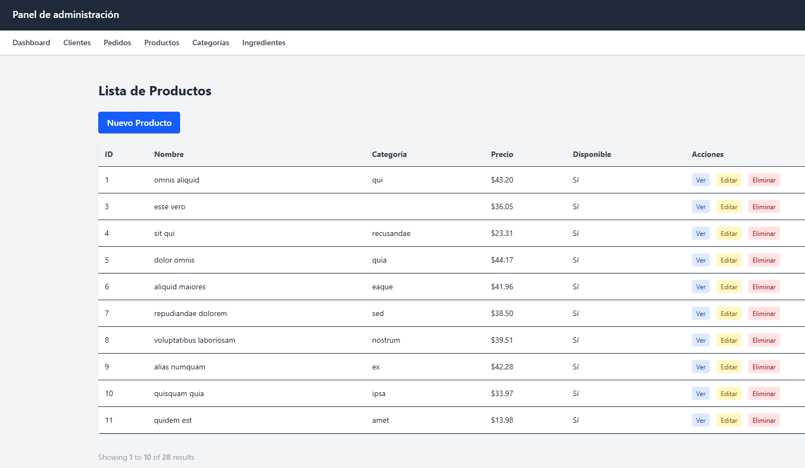  
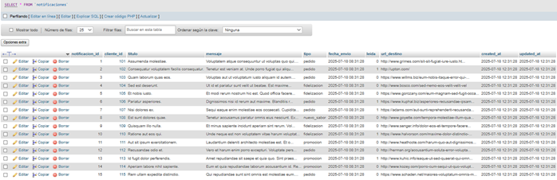  
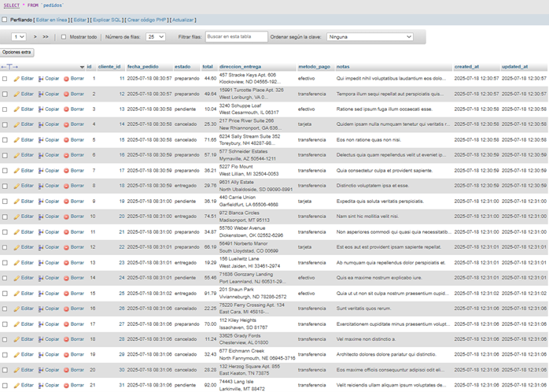  
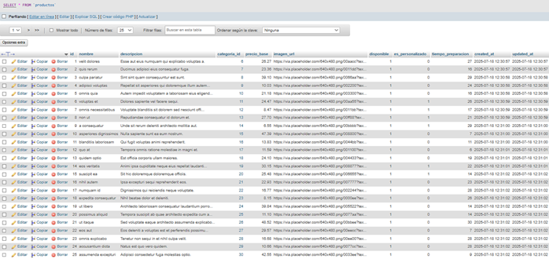  
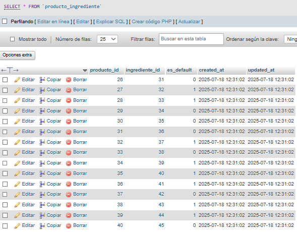  
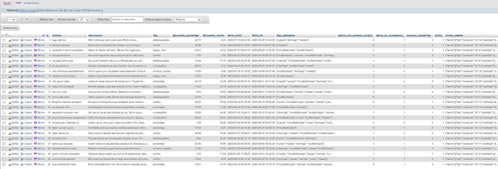  

📜 Licencia  
MIT License - Copyright (c) 2025 Fernanda Estrada - Celeste Ortiz

